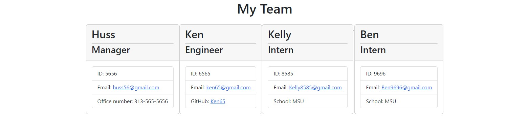

# Team-Huss-Profile-Gen

## Table of Contents: 
* [Description](#Description)
* [Actions Taken](#Actions)
* [Screen Shot](#Screen)
* [Links](#Links)

## Description :
For this week's assignment I create a Node.js command-line application that takes in information about employees on a software engineering team and generates an HTML webpage that displays summaries for each person. 

## Actions taken :
* Used Inquirer package to prompt the user with a series of questions (employee, emp ID, contact info, etc.) via the command-line interface. 
* Used the Jest package for running unit tests. 
* Used the "writefile" function to write the inputs onto a generated HTML. 
* Used bootstrap for basic styling, boxes/cards, web display.  
 
## Screen Shot :

 

## Links :
Video Link: https://drive.google.com/file/d/1j4S-N0FcE_foe73TIrKTSRVoHQzSB2XM/view
GitHub Link: https://github.com/hussrizk56/Team-Huss-Profile-Gen

